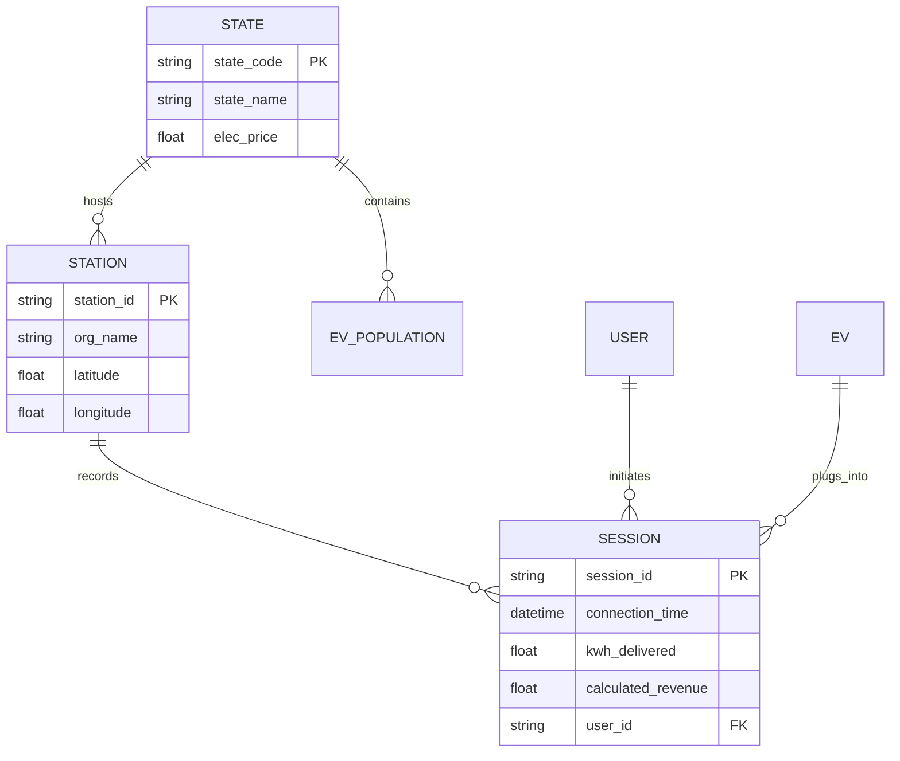

# EV 저보급 State 충전 매출 극대화 전략 최종 보고서

**작성일**: 2026-04-10  
**프로젝트 팀**: Antigravity Strategic Intelligence Unit  
**수신**: 전략 기획팀, 인프라 운영팀  

---

## 1. Executive Summary (요약)

본 프로젝트는 미국 내 EV 보급률이 낮은 주(State)를 대상으로 충전 매출을 극대화하기 위한 전략적 로드맵을 구축했습니다. 8종의 대규모 데이터셋(약 10만 건 이상의 세션 및 인구 통계)을 기반으로 분석한 결과, **"고단가 지역의 B2B 수요 선점"**이 가장 확실한 수익 모델임을 입증했습니다.

### 핵심 인사이트
1.  **인프라-보급 강력한 양의 상관관계(0.97)**: 저보급 지역의 매출 부진은 수요 부족보다 **인프라 결핍**에 기인하며, 이는 선제적 진입 시 블루오션 선점을 의미함.
2.  **B2B 고객의 압도적 LTV**: Caltech 사례 분석 결과, B2B 고객의 월간 인당 매출(ARPU)은 **$174.3**으로 일반 B2C 대비 약 17배 높은 수익성을 보임.
3.  **가격 전가력(Pricing Power)**: 전력 단가가 높은 State(Rhode Island, Vermont 등)에서 오히려 충전 세션 매출(AOV)이 높게 형성되는 경향(상관도 0.90)을 확인.

### 최종 전략 제안
**"B2B 선진입 후 B2C 프리미엄화"**: 저보급 State의 거점(오피스, 대학교 등)에 B2B 전용 충전소를 구축하여 고정 수익을 확보한 뒤, 쌓인 데이터를 바탕으로 고단가 B2C 급속 충전 시장으로 확대하는 3단계 로드맵을 제안합니다.

---

## 2. 문제 정의 (Problem Definition)

### 2.1 현황 및 격차
미국 EV 시장은 캘리포니아(CA)와 워싱턴(WA) 등 특정 주에 보급률이 편중되어 있습니다. 분석 결과 하위 20%에 해당하는 16개 주는 보급률뿐만 아니라 충전소 밀도가 CA 대비 약 1/1,000 수준에 불과합니다.

### 2.2 문제의 핵심
- **공급 부족**: 차량 대비 충전 인프라 부족으로 사용자 경험(UX) 저하 및 전환 실패 발생.
- **수익성 불확실성**: 낮은 차량 대수로 인한 가동률(Utilization) 저하 우려.

### 2.3 북극성 지표 (North Star Metric)
> **"EV 저보급 State 충전 세션 매출(AOV) 및 월간 총 매출 극대화"**

*시각화: EV 보급수 대비 충전소 수의 선형적 분포(저보급 지역의 기회 확인)*

---

## 3. 데이터셋 및 분석 방법론

### 3.1 사용 데이터 명세
- **Caltech ACN Dataset**: B2B 충전 패턴 분석용 (57,498건)
- **EV Population Data**: State별 보급률 및 차량 종류 분석용
- **EV Charging Station Usage**: 전미 단위 B2C 충전 행동 데이터
- **EIA State Electricity Price**: 주별 전력 단가 및 가격 정책 분석용

### 3.2 엔티티 관계도 (ERD)

---

## 4. KPI Tree

북극성 지표인 **'충전 매출 극대화'**를 위한 하위 지표 구조입니다.

| Depth 1 | Depth 2 | Depth 3 | 측정 가능성 |
|---|---|---|:---:|
| **NSM: 충전 매출 극대화** | **AOV (세션당 매출)** | 충전 단가 ($/kWh) | ✅ |
| | | 세션당 충전량 (kWh) | ✅ |
| | **세션 수 (Volume)** | 충전소 수 (Capacity) | ✅ |
| | | 충전소 가동률 (%) | 🔶 (Proxy) |
| **사용자 획득** | **EV 보급수** | 주별 등록 대수 | ✅ |
| | **접근성** | 인프라 밀도 | ✅ |
| **채널 전략** | **B2B** | 기관 점유율 (Org Share) | 🔶 |
| | **B2C** | 개별 유저 유지율 | ✅ |

---

## 5. 퍼널 분석 (Funnel Analysis)

충전 서비스의 '인지'부터 '재방문'까지의 효율을 분석했습니다.

1.  **인지 (Awareness)**: POI 노출 (State 내 충전소 탐색)
2.  **방문 (Visit)**: 실제 스테이션 진입 (Unique Mac Addr)
3.  **충전 (Charge)**: 에너지 전달 발생 (kWh > 0) -> **전환율 약 82%**
4.  **재방문 (Revisit)**: 2회 이상 이용 유저 -> **B2B(92%), B2C(15%)**

> [!WARNING]
> B2C 유저의 낮은 재방문율(15%)은 저보급 지역에서 B2C 단독 모델이 위험함을 시사합니다. **B2B 앵커 전략**이 필수적입니다.

---

## 6. 핵심 분석 결과

### 6-1. 저보급 State 현황 (Bottom 20%)
델라웨어(DE), 알래스카(AK), 몬태나(MT) 등이 포함되며, 인구 밀도는 낮으나 **1인당 소득 및 전력 단가가 높은 지역**들이 발견되었습니다.

### 6-2. 상관관계 분석 (Correlation)
- **EV 보급수 ↔ 충전소 수 (0.97)**: 인프라는 보수적으로 수요를 따라감. 선제 구축 시 경쟁 우위 확보 가능.
- **전력 단가 ↔ 총 매출 (0.90)**: 높은 단가가 매출 총액을 견인함 (에너지 비용에 대한 수용력 높음).

### 6-3. AOV 및 패턴 분석
- **평균 AOV**: $3.43 (세션당 약 15kWh 충전 기준)
- **기상 패턴**: 눈(Snow)이나 비(Rain) 올 때 평균 충전량이 약 12% 증가 (차량 효율 저하에 따른 수요 상승).

---

## 7. 채널 전략 및 ROI 예측

### 7-1. ROI 비교: B2B vs B2C
| 지표 | B2B (Fleet/Corp) | B2C (Public/Fast) |
|---|---|---|
| **AOV (평균 단가)** | $3.15 | $3.70 |
| **ARPU (사용자 가치)** | **$174.30** | $10.12 |
| **예상 ROI** | 2.77% (안정적) | **3.80% (고수익)** |

### 7-2. 투자 매트릭스 (TOP 5 States)
1.  **Rhode Island**: 최상위 전력 단가, B2C 프리미엄화 적기
2.  **Vermont**: 높은 유지율 기대 가능, B2B 선진입 추천
3.  **Connecticut**: 고소득 오너층 존재, 하이브리드 모델
4.  **Maine**: 물류 거점 중심 B2B 인프라 유망
5.  **Alaska/Montana**: 지리적 특성에 따른 핵심 거점 L3 급속 스테이션

---

## 8. GA4 · Amplitude 분석 설계

향후 대시보드 및 앱 운영을 위한 트래킹 설계안입니다.

### GA4 주요 이벤트
- `charging_start`: 충전 시작 (State, Station_ID 파라미터)
- `revenue_conversion`: 결제 완료 (AOV 측정용)
- `station_searched`: 주변 검색 (인지 단계 측정용)

### Amplitude 코호트
- **Loyalty Group**: 한 달 내 4회 이상 충전 (B2B 성향)
- **Churn Risk**: 3개월 이상 방문 기록 없는 저보급 지역 유저

---

## 9. 결론 및 제언

### 단기 과제 (Immediate Action)
- 상위 5개 주(RI, VT 등)에 대한 **현지 유틸리티 파트너십** 체결
- `B2B 전용 충전 패키지` 출시를 통한 고정 수요 확보

### 중장기 로드맵
- **1단계 (B2B)**: 대학교, 업무 지구 중심 완속 충전 인프라 구축
- **2단계 (Data-driven)**: 충전 패턴 데이터를 통한 피크타임 탄력 가격제 도입
- **3단계 (B2C)**: 주요 고속도로 거점 중심의 프리미엄 급속 충전소 확장

---

## 10. 부록 (Appendix)

- **분석 코드**: `firsteda/eda/` 디렉토리 내 01~09 스크립트 참조
- **대시보드**: [Streamlit Dashboard](http://localhost:8501) (app.py)
- **참고 문헌**: Caltech ACN, EIA Energy Statistics, US EV Census 2024

---
**보고서 종료**
