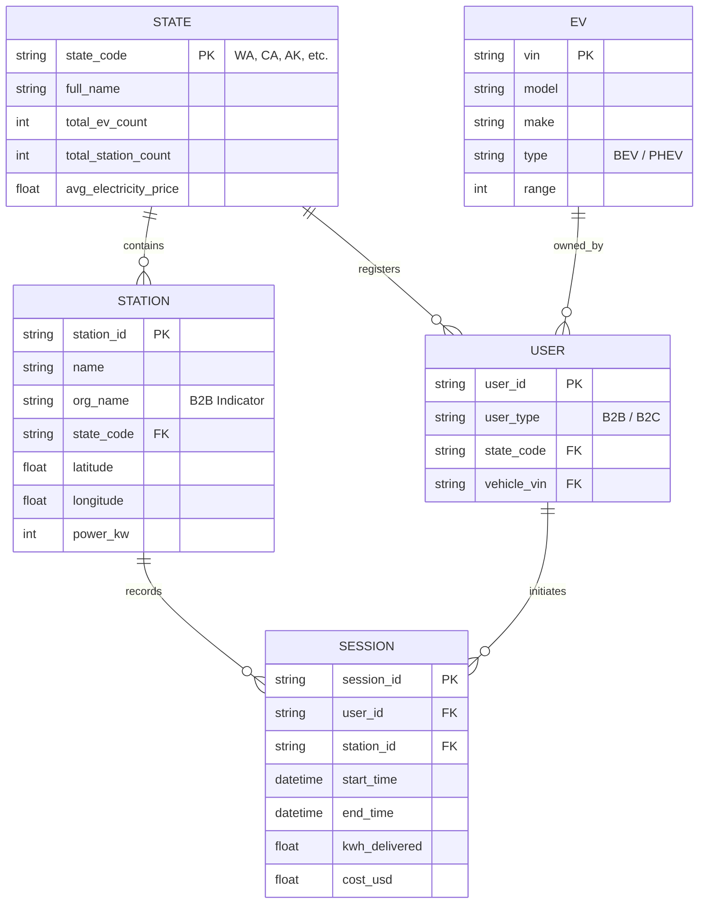
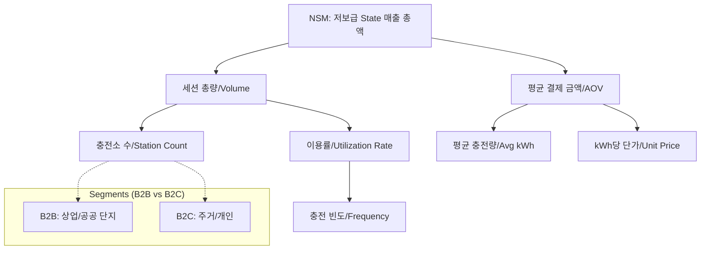

# EV 저보급 State 충전 매출 극대화 전략 프레임워크

이 문서는 EDA 결과를 바탕으로 수립된 프로젝트의 논리적 구조와 핵심 지표 정의서입니다.

---

## 1. ERD (Entity-Relationship Diagram)

Mermaid를 활용한 핵심 엔티티 및 관계도입니다.

---

## 2. KPI Tree 및 North Star Metric

### 🌟 North Star Metric (NSM)
> **"저보급 State 내 월간 충전 세션 매출 총액 (Total Monthly Revenue in Target States)"**
> - **이유**: 보급률이 낮은 지역에서 수익성을 확보하는 초기 모델을 성공시켜 인프라 확장의 선순환 구조를 만들기 위함.

### 🌳 KPI Tree 구조 (Integrated Model)

---

## 3. 퍼널 분석 (Funnel Definition)

데이터셋별 매핑을 통한 퍼널 단계 및 측정 방식입니다.

| 단계 | 정의 | 데이터 소스 | 측정 지표 (KPI) |
|---|---|---|---|
| **1. 인지 (Awareness)** | 지역 내 충전소 존재 인지 | `station_locations` | 충전소 POI 밀도 (Station Density) |
| **2. 방문 (Visit)** | 충전소 접근 및 플러그 인 | `station_usage` | 고유 차량 방문 수 (Distinct Users) |
| **3. 결제 (Charge)** | 실제 충전 세션 개시 | `caltech`, `usage` | 전환율 (Sessions / Total Capacity) |
| **4. 재방문 (Revisit)** | 충전소 재사용 | `caltech` | 고객 유지율 (Retention: 2회 이상 이용자%) |

---

## 4. 유저 저니 (User Journey) 및 시나리오

### [Case B2C] 초보 EV 사용자의 저보급 지역 여행
1. **탐색**: 지도(POI)에서 충전 가능한 스테이션 확인 (Awareness)
2. **이동**: 최적의 위경도 정보를 바탕으로 방문 (Visit)
3. **충전**: 소량 충전 후 단가 확인 (Charge)
4. **유지**: 편리성 경험 후 다음 여행 시 동일 브랜드 재방문 (Revisit)

### [Case B2B] 저보급 State 내 법인 차량(Fleet) 운영
1. **계약**: 특정 지역의 Org Name 기반 스테이션 사용 협약 (Awareness)
2. **루틴**: 업무 시간 중 정해진 스테이션 주기적 방문 (Visit)
3. **충전**: 대용량 kWh 충전 및 자동 비용 정산 (Charge)
4. **고착**: 대규모 충전량 기반 고정 고객화 (Revisit)

---

## 5. 핵심 가용 지표 및 제약 사항 (Proxy 전략)

- **측정 가능**: kWh당 단가(Standardized from `elec_price`), 세션당 충전량, 요일/시간대별 빈도.
- **Proxy 필요**: 
    - **인지 단계**: 마케팅 지표가 없으므로 '주거지로부터의 거리' 또는 '전체 POI 중 비중'을 대리 지표로 활용.
    - **B2B 식별**: `station_usage`의 `Org Name` 중 'University', 'Corporate Office' 등을 B2B로 분류하여 ROI 비교.
